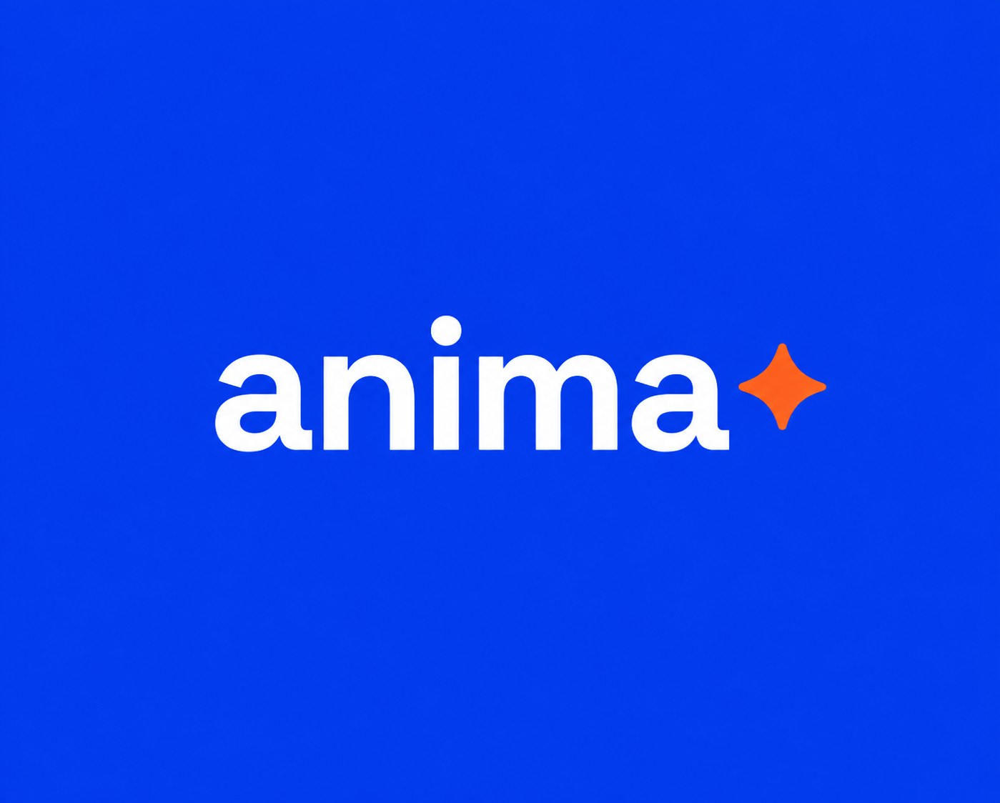

<div align="center">



**Notes on a shared canvas. Your own AI tools read and write them too.**

Human-readable markdown stored on [Walrus](https://walrus.xyz), sealed with [Seal](https://seal-docs.wal.app) under your [Sui](https://sui.io) wallet, so your work outlives any app, including ours.

[](LICENSE)
[](https://overflow.sui.io)
[](https://walrus.xyz)
[](https://docs-anima.kadzu.dev)

[Documentation](https://docs-anima.kadzu.dev) · [Quickstart](https://docs-anima.kadzu.dev/build/quickstart) · [anima-mcp](https://docs-anima.kadzu.dev/build/mcp-reference)

</div>

---

## Overview

Anima is an agentic workspace. You, your team, and the AI agents you already use work on one shared board of notes and canvas. Claude Code, Codex, or any MCP-capable agent connects through `anima-mcp` and reads and writes the same notes, each edit signed with a name and revision. Every note is human-readable markdown stored on Walrus and sealed with Seal under your Sui wallet, so it belongs to you, not to a vendor.

## Why

The notes and work your AI agents accumulate are valuable, and on a normal SaaS you don't own them, can't read them, and lose them at the vendor's whim. Replika's "lobotomy" turned years-old companions into strangers overnight. Dot shut down with 30 days to export. Meta bought Limitless and gave users 14 days before deletion. Anima makes that structurally impossible: your notes live on neutral ground, readable and editable by you, sealed to your wallet, not to any company, including us. That custody and survival is what a Postgres + S3 SaaS cannot structurally promise.

## What it does

- **Your own agents read and write.** `anima-mcp` lets Claude Code, Cursor, or any agent you use read and write the same notes, each edit signed (name + rev).
- **Notes and canvas.** Browse, search, edit, and delete your notes; edits change agent behavior live.
- **Cited answers.** "What do you know about my sister?" gets an answer that navigates to and cites the notes.
- **Forget, for real.** Deletion is wallet-gated and verifiable.
- **Built-in companion.** A default agent that remembers across sessions and writes durable facts back as notes you can read (a resident, not the product).
- **Resurrection.** Kill the app, open another client with a different model, connect your wallet: full notes intact.
- **Export.** Your whole workspace as a markdown zip; file over app.

## How it works

- **You own the storage.** Notes are markdown blobs on Walrus, encrypted with Seal. The policy that can decrypt them is a Move contract that names your wallet, not a key any app operator holds.
- **Two keys, one vault.** Your wallet authorizes the high-stakes actions (create a vault, pair an agent, delete). A per-device agent key signs ordinary reads and writes, so saving a note costs no wallet popup and no gas.
- **Agents are first-class.** `anima-mcp` is a stdio MCP server that runs on your own machine. Any MCP-capable agent works the same vault you do, with every edit attributed.
- **The backend is replaceable.** The Go chat service is stateless: no database, no session store, no logged content. Kill it and the vault survives, which is the whole point.

## Project structure

```
frontend/   React + Vite + TS: wallet, chat, notes, canvas
backend/    Go: stateless chat API + LLM orchestration (OpenRouter default, modular providers)
chain/      TS workspace
  core/       shared Walrus (quilts) + Seal + vault logic
  mcp/        anima-mcp, stdio MCP server, runs user-side (npx)
contract/   Move: Seal access policy (the only on-chain code)
docs-site/  public documentation (Fumadocs)
scripts/    pairing, funding, and ops helpers
```

## Getting started

Prereqs: Node and [pnpm](https://pnpm.io); Go 1.25+ for the chat backend.

```sh
pnpm install
pnpm dev          # frontend on http://localhost:5173
pnpm build        # production build
pnpm test:frontend && pnpm test:chain   # tests
```

The chat backend is a stateless Go proxy. See [`backend/README.md`](backend/README.md) for environment variables and `go run ./cmd/api`. Full setup, self-hosting, and the agent quickstart live at [docs-anima.kadzu.dev](https://docs-anima.kadzu.dev).

## Documentation

- [Using Anima](https://docs-anima.kadzu.dev/use/getting-started): capture notes, ask the companion, publish, and export.
- [Building with Anima](https://docs-anima.kadzu.dev/build/quickstart): connect your own agent over `anima-mcp`.
- The docs are agent-readable: every page is served as clean markdown, and the whole site is indexed for coding agents at [`/llms.txt`](https://docs-anima.kadzu.dev/llms.txt).

## License

[MIT](LICENSE) © 2026 mfahriferdiansyah.

---

<div align="center">

Building period: May 7 to June 21, 2026. Testnet first, mainnet-ready architecture.

Built for [Sui Overflow 2026](https://overflow.sui.io), Walrus track.

</div>
