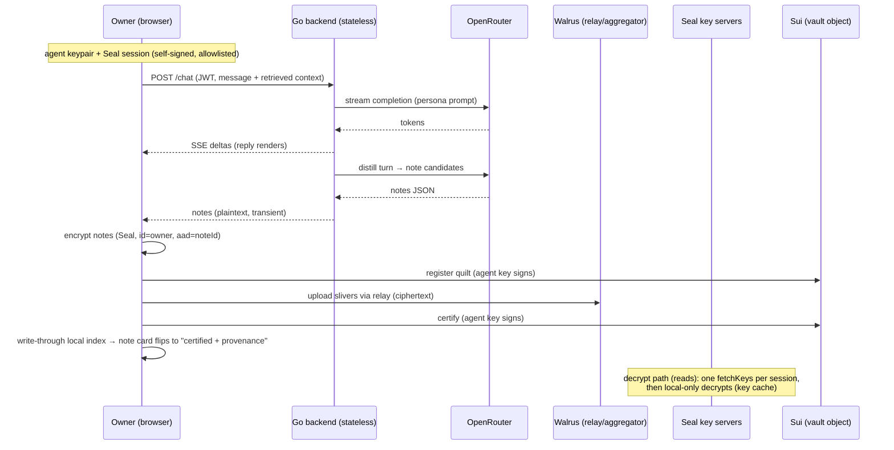

# feat: ANIMA MVP — owned agent-memory vault + companion

## Summary

Build ANIMA in 11 days as four surfaces sharing one custody line: a Move policy package (`contract/`) whose vault object holds an **allowlist of agent keys**; a TS `chain/core` library (Walrus quilts + Seal + note schema) that runs **client-side only** (browser and MCP — no hosted chain service); a stateless Go backend (LLM proxy via OpenRouter + wallet-JWT auth); and a React frontend with chat + vault views, plus a minimal resurrection alt-client. Sequenced as: day-1 commit-gate spike → contract → core library → backend → onboarding → chat loop → vault UI → MCP → resurrection/reconnect/revoke → seed + polish → deploy/video/submission (June 21 PT deadline).

---

## Problem Frame

Sui Overflow 2026 Walrus-track submission (see origin doc for full product framing). Plan-specific framing: 11 calendar days, 2–3 TS-strong devs with limited Move, judged on a working end-to-end system + ≤5-min video, with a hard external dependency set (Sui testnet, Walrus storage nodes, Seal key servers, OpenRouter) that must perform on camera.

---

## Requirements

Carried from origin (R1–R13) plus four plan-time adds confirmed by the user (2026-06-10):

- R1–R13. As specified in origin: markdown-note memory substrate (R1–R4), vault interface (R5–R8), interop via MCP (R9–R10), survival/resurrection (R11–R12), hackathon submission mechanics (R13).
- R14. Owner can export the entire vault as a markdown zip (file-over-app receipt).
- R15. Returning user: reconnecting a wallet with an existing vault skips creation, re-registers/refreshes agent keys as needed, and rebuilds the local index (covered by U5; judges will reopen the app on day two).
- R16. Revoke: owner can remove an agent key via wallet tx; the revoked agent's next **fresh session** visibly fails — a new SessionKey fetch is refused by `seal_approve`, and the client's write path refuses via an allowlist-membership preflight. Honest bounds (review-verified): Walrus itself cannot reject a revoked key's raw writes, and previously cached Seal keys may serve until the client process restarts — the demo therefore restarts the revoked client before the failing attempt, and the README custody table states the cached-key window explicitly.
- R17. Ciphertext denial (negative proof): the demo shows raw blob bytes via public aggregator/explorer are ciphertext — nothing readable without the owner's authorization.

**Origin actors:** A1 Owner, A2 Companion, A3 External agents (MCP clients), A4 the (dead) vendor.
**Origin flows:** F0 onboarding, F1 chat loop, F2 browse/edit/forget, F3→(renamed F4) external agent, F5 resurrection (origin numbering: F1–F4; this plan uses origin F-IDs).
**Origin acceptance examples:** AE1 (weeks-old recall + citation), AE2 (edit→behavior change live), AE3 (MCP shared brain + attribution), AE4 (resurrection + explorer ownership).

---

## Scope Boundaries

### Deferred for later (carried from origin)

- Visual graph view (backlinks list is the v1 floor); memory decay/summarization; multi-vault/multi-persona; mobile/voice; mainnet production deploy + payments; monetization mechanics.

### Outside this product's identity (carried from origin)

- Multi-agent coordination platforms, marketplaces, reputation/work-history; "verifiability/proof as the product" (audit/compliance framing); memory *infrastructure* plays (MemWal is the sponsor's); prediction markets.

### Deferred to Follow-Up Work (plan-local)

- npm publish of `anima-mcp` is optional polish (configs can point at `node dist/index.js`); publish only if U8 lands early — `npx -y anima-mcp` is a nice beat, not a requirement.
- Embedding-based retrieval: v1 ships tags/keyword/recency retrieval; an embeddings upgrade is follow-up.
- Edit does NOT delete the superseded blob version in v1 (latest-wins index handles it); cleanup tx is follow-up.

---

## Context & Research

### Relevant Code and Patterns

- Greenfield repo (`anima/`): no local patterns. Authoritative external patterns to mirror:
- Seal example frontend (`MystenLabs/seal/examples/frontend/src/AllowlistView.tsx`) — dapp-kit + SessionKey + IndexedDB persistence; copy this shape for U5.
- Seal Move patterns (`MystenLabs/seal/move/patterns/sources/account_based.move`, `whitelist.move`) — basis for U2's policy.
- `openai-go` streaming example (`examples/chat-completion-streaming/main.go`) — basis for U4's provider.
- MCP official servers (e.g. `server-filesystem`) — packaging/bin pattern for U8.

### Institutional Learnings

- `docs/solutions/` does not exist yet (greenfield). Key session learnings are baked into decisions below (version pins, two-key model, ownership trap).

### External References

- Research memos (2026-06-10, verified against npm tarball type definitions + live testnet): @mysten/walrus v1.1.7 API + costs; @mysten/seal v1.1.3 + key-server IDs; app-stack (MCP SDK v1.29, dapp-kit 1.0.6, openai-go v3, Coolify monorepo); adversarial flow analysis (C1–C7 corrections, top-10 edge cases, demo-fragility table). Sources listed at bottom.

---

## Key Technical Decisions

- **Version pins (ecosystem-aligned, June 2026):** `@mysten/sui@^2.16.2` · `@mysten/walrus@^1.1.7` (NOT 0.6.7 — stale, breaks against sui 2.x) · `@mysten/seal@^1.1.3` · `@mysten/dapp-kit@1.0.6` (legacy-but-current; matches the only shipped Seal example; note `dapp-kit-react` migration in README) · `@modelcontextprotocol/sdk@^1.29` (v1.x; v2 is pre-alpha; `inputSchema` is a ZodRawShape, not `z.object()`) · `github.com/openai/openai-go/v3`.
- **Two-key model (corrects origin's single "session key"):** (1) an **agent keypair** (Ed25519, generated and held client-side — browser IndexedDB / MCP local config) signs Walrus register/certify txs and needs small SUI+WAL balances; (2) Seal **SessionKey** authorizes decryption (≤30-min TTL) and is **self-signed by the agent keypair** (`SessionKey.create({ signer })`) — possible because of the allowlist policy below. Result: zero wallet popups after onboarding; silent TTL renewal.
- **Allowlist Move policy (the keystone):** vault object stores owner + companion name + allowlist of agent addresses. `seal_approve(id, vault)` passes when PTB sender ∈ {owner} ∪ allowlist (key servers dry-run with sender = session certificate's user = the agent address). Register/revoke agent keys are owner-only entry functions. This one design choice eliminates the mid-chat popup problem, defines MCP pairing (register its key), and makes revoke (R16) a one-tx demo.
- **Custody line / no hosted chain service (user-confirmed):** chain logic runs only where the user's keys live (browser, MCP). Walrus traffic goes through the official upload relay/aggregator (ciphertext only — an encrypted pass-through service of our own would duplicate Mysten's public infra; if it signed anything it would custody blobs). The Go backend is a **stateless LLM proxy**: transiently sees chat context during inference (narrate honestly — true of every AI product), stores nothing, holds no keys. Honest claim: *nothing can read your memory at rest; nothing custodies it; kill every server and the vault survives.*
- **Blob ownership (resolved at U1 gate):** certify-tx sender must own the Blob object, so silent writes land blobs under the agent address. Resolution order: (a) try `owner:` param + agent-signed certify; if certify then fails ownership, (b) agent owns at write + append `transferObjects` to wallet in the same PTB; if neither, (c) blobs stay under agent address and the vault object tracks blob IDs (R12's explorer beat then shows the vault object's registry instead of direct wallet ownership). U1 decides empirically; the rest of the build consumes whichever lands.
- **Quilt granularity = one quilt per chat turn** (origin Q resolved): natural batch, atomic write; **forget = rewrite surviving notes into a new quilt first, then delete the old quilt** (deletable blobs; per-patch deletion doesn't exist). Seeded notes must also be written `deletable: true`.
- **Note schema (C4):** encrypted frontmatter carries `noteId`, `version`, `updatedAt`, `author`, `tags`, `links`; index rule = latest-version-wins per noteId; deletion is real blob deletion (no tombstones). Same-noteId concurrent edits = last-write-wins (declared).
- **Retrieval = client-side disposable index** (IndexedDB), rebuilt from Walrus: tags + keyword + recency scoring for v1 (demo-scale vaults); write-through on write/edit/delete (kills stale-cache bugs and makes AE2 instant). Seal `id` = owner address (one identity per vault) ⇒ one `fetchKeys` round-trip per session, all subsequent decrypts local — the single biggest latency lever.
- **Seal encryption identity & hygiene:** `packageId` = first version of our published package; `id` = owner address bytes (hex, no 0x); pass `aad` = noteId bytes; keep one `SealClient` singleton (key cache). Key servers: hardcode testnet object IDs (the SDK **removed** `getAllowlistedKeyServers`), threshold 2 over 4+ servers (Mysten ×2 + Ruby Nodes + NodeInfra; optionally the 3-of-5 committee server as one entry).
- **Backend auth (C6):** wallet-signed nonce → short-lived JWT; protects the OpenRouter budget. LLM provider interface in Go with OpenRouter as default impl (OpenAI-compatible adapter also covers OpenAI/DeepSeek direct).
- **Node/undici fix everywhere chain code runs in Node (MCP, scripts, tests):** custom fetch agent with `connectTimeout: 60s` + `storageNodeClientOptions.timeout: 60s`; retry on `RetryableWalrusClientError` via `client.walrus.reset()`.
- **Testnet realities:** epochs ≈ 1 day → seed and app writes use `epochs: 53` (max); deterministic re-runnable seed script doubles as testnet-wipe recovery and demo reset; never faucet on camera (pre-funded wallets); SUI faucet → official 1:1 SUI→WAL exchange for WAL.
- **Mainnet-ready honesty:** Walrus mainnet is config; Seal mainnet requires a Permissioned-mode key-server relationship or Enoki — state this in README as the mainnet path rather than implying a flag flip.
- **XSS posture (the custody pitch demands one):** the agent key in IndexedDB is extractable by same-origin JS — mitigations shipped: strict CSP header (no unsafe-inline, no wildcard script-src) served from the frontend container, minimal third-party script inventory (dapp-kit + our code only), and an honest README line naming the residual risk. Deferred question for U5: probe whether a WebCrypto non-extractable signing shim over the Sui Signer interface is cheap — if yes, adopt.
- **Storage namespacing:** all browser persistence (agent key, session export, index, dapp-kit state where configurable) is key-prefixed per client (`anima:` main app, `alt:` alt-client) so the two Vite entries behave as independent clients even on one browser profile — without this the resurrection beat looks faked to a judge reproducing on the same profile.
- **Theme tokens land before components:** `frontend/src/theme/tokens.ts` with committed values (canvas `#0a0a0a`, surface, border `rgba(255,255,255,0.08)`, 3-size type scale + weights, orb gradient stops + pulse keyframe timing, note-glow box-shadow) is a U5 deliverable, consumed by U6/U7 — theme as foundation, not retrofit. U10 polishes; it does not introduce tokens.
- **Flow-ID mapping (plan-local):** F0 onboarding (added in origin's deepening pass), F1 chat, F2 vault/forget, F4 external agent (= origin F3), F5 resurrection (= origin F4). The plan skips "F3" to avoid colliding with origin's pre-deepening numbering; unit headers use the plan-local IDs above.

---

## Open Questions

### Resolved During Planning

- Quilt batching granularity → one quilt per turn (above).
- Retrieval approach → client-side tags/keyword/recency index; embeddings deferred.
- MCP build → own server on MCP SDK v1.x with own agent keypair + pairing flow; memwal-mcp not reused (different custody model).
- Seal session UX → allowlist policy + agent-key-signed SessionKey; pre-warm decrypt before demo beats.
- Hosted chain service → cut (user-confirmed; custody + redundancy rationale).

### Deferred to Implementation

- Blob ownership mechanism (a/b/c above) — empirical, decided inside U1.
- Exact SUI gas per register/certify on testnet — measure at U1; feeds the pricing panel.
- Whether `flow.upload` via relay vs direct storage-node fan-out performs better from the browser — measure at U1 (relay expected; tip ≈ 105 MIST const).
- Distiller prompt shape (what becomes a note vs no-op) — tune during U6 with real conversations.

---

## Edge Cases (referenced as #N throughout; from the adversarial flow analysis)

1. Walrus write fails/times out after the LLM reply renders → note card shows retry state; no provenance until certified; chat unaffected.
2. Blob ownership: write via agent signer → Blob queryable under the decided owner; wallet (or designed signer) can delete it.
3. Forget → re-ask with the fact still in the transcript context window → must scrub transcript context; prove forgotten in fresh context.
4. Forget a note in a shared quilt → survivors rewritten FIRST, old quilt deleted second, index patchIds remapped, nothing innocent lost.
5. Cold resurrection: new machine, wallet only → vault id + companion name + all latest-version notes recovered; edits show latest; deleted absent.
6. Agent key expiry/revocation/unfunded mid-session → silent renewal or clean re-grant/re-pair error; no hang.
7. Agent key out of SUI/WAL mid-chat → preflight check, top-up prompt, no silent write loss.
8. Concurrent writers (MCP + companion same minute, incl. same-noteId edit) → index converges latest-wins on both clients.
9. Page refresh mid-chat → index rebuilds; AE2 still passes post-refresh; transcript ephemerality labeled.
10. Seal key servers slow/timeout on first fetch → retry UI, cached keys serve repeats; never a blank vault.

---

## Output Structure

    anima/
    ├── frontend/                  # React + Vite + TS (Coolify app 1)
    │   ├── src/
    │   │   ├── app/               # providers (dapp-kit, query), router
    │   │   ├── onboarding/        # F0: connect → create vault PTB → fund agent key
    │   │   ├── chat/              # F1: chat UI, SSE client, distill loop
    │   │   ├── vault/             # F2: note list/search/backlinks, editor, forget, stats, export
    │   │   ├── alt-client/        # F5: second entry point, separately branded
    │   │   └── lib/               # agent-key store (IndexedDB), backend auth, index
    │   └── Dockerfile
    ├── backend/                   # Go chi (Coolify app 2)
    │   ├── cmd/api/
    │   ├── internal/auth/         # wallet-nonce → JWT
    │   ├── internal/llm/          # ChatProvider iface + openrouter impl
    │   ├── internal/chat/         # SSE handler, persona + distiller prompts
    │   └── Dockerfile
    ├── chain/                     # pnpm workspace (no deployed service)
    │   ├── core/                  # vault client: notes, quilts, seal, index, funding
    │   └── mcp/                   # anima-mcp stdio server (bin)
    ├── contract/                  # Move: vault + seal_approve allowlist policy
    │   ├── sources/vault.move
    │   └── Move.toml
    ├── scripts/                   # seed.ts, fund.ts, publish-contract.sh
    ├── docs/                      # brainstorm, this plan, demo-script.md
    └── .mcp.json                  # committed: judges connect Claude Code to anima-mcp

---

## High-Level Technical Design

> *This illustrates the intended approach and is directional guidance for review, not implementation specification. The implementing agent should treat it as context, not code to reproduce.*

Key/custody map: plaintext **at rest** and keys exist only at the edges (browser, MCP); chat context and distilled notes transit backend/OpenRouter transiently during inference (mirror this exact framing in the README custody table — name OpenRouter explicitly). Walrus: ciphertext. Sui: vault object (owner, name, allowlist, blob registry if option c).

---

## Implementation Units

### U1. Day-1 commit-gate spike (chain foundations)

**Goal:** Prove the entire chain path on testnet before any app code; resolve the blob-ownership question; produce go/no-go.

**Requirements:** R2, R11, R12 (foundation for all); origin Day-1 gate.

**Dependencies:** None. **Owner:** most chain-comfortable dev; everyone blocked on this — pair on it.

**Files:**
- Create: `chain/core/package.json`, `chain/core/src/spike.ts` (throwaway harness), `scripts/fund.ts`
- Test: `chain/core/src/__tests__/spike.testnet.test.ts` (tagged integration, not CI-default)

**Approach:**
- Fund: faucet SUI → exchange to WAL (official 1:1 exchange objects; verify TS-side swap or shell out to `walrus get-wal` once and document).
- Round-trip: `writeFiles` (2 markdown WalrusFiles, `epochs: 53`, `deletable: true`, agent-key signer, upload relay w/ tip max) → `getFiles` by patch id → byte-equality.
- **Keystone smoke (GO requires this, not just the round-trip):** throwaway-publish BOTH `account_based.move` AND `whitelist.move` patterns; encrypt to `id = ownerAddr`; then decrypt with a **NON-owner whitelisted keypair's self-signed SessionKey** against the 2-of-4 key-server set. This proves key servers honor the allowlist path the entire popup-free architecture rests on (silent chat writes, MCP, resurrection). Also verifies `SessionKey.create` accepts a raw Ed25519 keypair signer end-to-end. **Pre-agreed fallback if it fails:** wallet-signed SessionKeys (one popup per ~25 min, demo-scripted around) — degraded but shippable.
- Ownership experiment (decision a/b/c per Key Technical Decisions): try `owner: walletAddr` with agent-signed certify; record result; try certify-**then**-transfer (transfer must come after certify — certify must be signed by the current Blob owner); pick and document in `docs/decisions.md`. **Per-option acceptance criteria (forget/revoke depend on these):** (i) the wallet (or designed signer) can delete a quilt post-write; (ii) a revoked agent cannot delete vault memories; (iii) forget works post-resurrection without the original agent key. If option (c) wins, the delete-authority design must be reworked before GO is declared.
- **Blob enumeration decision (consumed by U3/U5/U9):** record how `listVaultQuilts()` works under the chosen option — (a)/(b): `getOwnedObjects(owner=wallet, type=Walrus Blob)` filtered to vault quilts (define the filter: attributes or registry); (c): read the vault object's registry.
- Delete round-trip: `executeDeleteBlobTransaction` for a `deletable` quilt; verify gone.
- Benchmarks: write latency (expect 5–15 s), first decrypt latency, gas per register/certify; record numbers for the pricing panel and demo pacing.

**Test scenarios:**
- Happy path: quilt write → read both files back byte-identical; tags round-trip.
- Edge: `deletable:true` quilt deleted → `getFiles` fails appropriately; storage object freed.
- Edge (Covers AE4 foundation): blob/quilt visible on suiscan owned by the decided owner (wallet or vault-registry).
- Error path: kill network mid-write → `onStep` checkpoint allows resume or clean retry; `RetryableWalrusClientError` → `reset()` + retry succeeds.

**Verification:** All round-trips + the keystone smoke pass on testnet; ownership decision recorded with acceptance criteria met; latency/gas numbers documented.

**NO-GO clause (explicit, decision deadline EOD Jun 11):** (1) quilt round-trip fails → fall back to the Walrus HTTP publisher/aggregator write path (publisher signs — weaker custody claim, narrated honestly in README) and continue ANIMA; (2) keystone allowlist smoke fails → fall back to wallet-signed SessionKeys (periodic popups, demo-scripted); (3) BOTH fail → stop, escalate to the team same day for a scope/track decision. No archived pivot ladders apply — they predate ANIMA.

---

### U2. Move contract: vault + allowlist policy

**Goal:** The on-chain keystone: vault object (owner, companion name, agent-key allowlist, optional blob registry) + `seal_approve`.

**Requirements:** R2, R8 (policy), R16; enables silent sessions (F1) and MCP pairing (F4).

**Dependencies:** U1 (ownership decision may add a registry field).

**Files:**
- Create: `contract/Move.toml`, `contract/sources/vault.move`
- Test: `contract/tests/vault_tests.move`
- Create: `scripts/publish-contract.sh` (captures packageId + vault type into a shared env/json consumed by core/frontend/mcp)

**Approach:**
- `create_vault(name)` → shared Vault { owner, name, agents: VecSet<address>, created_at } transferred/shared appropriately; `register_agent(vault, addr)` / `revoke_agent(vault, addr)` owner-only; `seal_approve(id, vault, ctx)`: assert `id == bcs(owner)` AND (`sender == owner` OR allowlist contains sender). Non-public `entry`, side-effect free, no fast-changing state (per Seal rules).
- Keep Move minimal (~80–120 lines); adapt `account_based.move` + `whitelist.move` patterns verbatim where possible.
- **Package-version pin:** Seal requires the FIRST package version — publish once, no upgrades during the hackathon; any policy change = new publish + re-encrypt seeds (another reason the seed script must be re-runnable).

**Execution note:** Write Move unit tests first (limited-Move team; tests are the spec).

**Test scenarios:**
- Happy: owner passes seal_approve; registered agent passes; outsider aborts ENoAccess.
- Happy (Covers R16): revoke removes agent → same agent now aborts.
- Edge: id ≠ owner bytes aborts even for owner (wrong-identity encrypt caught early).
- Edge: register same agent twice idempotent or clean abort (decide; test it).
- Error (privilege escalation): a REGISTERED non-owner agent calls `register_agent` or `revoke_agent` → aborts with access error (owner check must read `vault.owner`, the stored field — never the gas payer/sponsor).

**Verification:** `sui move test` green; published to testnet; a Seal decrypt using a registered agent's self-signed SessionKey succeeds against it (smoke via U3).

---

### U3. chain/core: vault client library

**Goal:** The one implementation of notes/quilts/Seal/index/funding both frontend and MCP import.

**Requirements:** R1–R4, R7 (write-through), R14 (export), R15 (rebuild).

**Dependencies:** U1 (decisions), U2 (packageId).

**Files:**
- Create: `chain/core/src/{notes.ts,quilts.ts,seal.ts,index.ts,funding.ts,export.ts,types.ts,config.ts}`
- Test: `chain/core/src/__tests__/{notes,index,export}.test.ts` (pure-unit, mocked clients) + `integration.testnet.test.ts`

**Approach:**
- `notes.ts`: frontmatter schema (noteId ULID, version, updatedAt, author, tags, links) ↔ markdown serialize/parse.
- `quilts.ts`: writeTurn(notes[]) → encrypt each (aad=noteId) → WalrusFiles (identifier = `noteId@version`) → one quilt; readAll(vaultRefs) → decrypt → notes; forget(noteIds) → survivors-rewrite-first, delete-old-second (edge-case #4); undici timeout config baked in for Node consumers.
- `index.ts`: latest-version-wins materialization; search (tags/keyword/recency scoring); write-through API; serialize to IndexedDB (browser) / JSON file (MCP).
- `seal.ts`: SealClient singleton, hardcoded testnet key-server configs (2-of-4), session bootstrap from a `Signer`, retry-on-`InvalidParameter` backoff, NoAccess = terminal. **AAD = `vaultObjectId || noteId`** (binds ciphertext to both vault and note — prevents cross-vault replay; one line, matched at decrypt).
- `index.ts` additionally exposes `listVaultQuilts()` per U1's enumeration decision — the single discovery API consumed by U5 rebuild and U9 cold-start.
- `funding.ts`: balance preflight (SUI+WAL), faucet helper, exchange swap; threshold warnings surfaced to UI (edge #7).
- `export.ts`: decrypt-all → zip of `.md` files (R14) — trivial atop readAll.
- **Minimal seed (moved up from U10 — AE1/AE2 are verified Jun 15, four days before U10):** `scripts/seed.ts` v0 ships with U3 by Jun 13 — the wedding note, the coffee-preference note, ~10–15 tagged filler notes, `epochs: 53`, `deletable: true`, seed-tag in frontmatter. U10 expands to the full demo corpus.

**Test scenarios:**
- Happy: distilled notes → quilt → read → identical notes incl. frontmatter.
- Happy (Covers AE2 foundation): edit note → new version → index returns latest only.
- Happy (Covers R14): export zip contains every latest note as readable markdown.
- Edge (#4): forget one of three notes sharing a quilt → survivors intact under new quilt, old deleted, index remapped.
- Edge (#8): two writers append concurrently (simulated) → index converges latest-wins on both.
- Error (#1): certify fails after register → write surfaces retryable failure; no index entry until certified.
- Error (#10): all key servers timeout on first fetch → clear retry error; cached-key reads still serve.

**Verification:** Unit suite green in CI; integration suite green against testnet; bundle imports cleanly in both Vite (wasmUrl configured) and Node (MCP).

---

### U4. Go backend: stateless LLM proxy

**Goal:** Auth + persona chat streaming + distiller, with the provider abstraction; zero state.

**Requirements:** R3 (distiller), R4 (persona uses context); C6 auth; supports F1/F5.

**Dependencies:** None (parallel with U1–U3).

**Files:**
- Create: `backend/cmd/api/main.go`, `backend/internal/auth/{nonce.go,jwt.go,middleware.go}`, `backend/internal/llm/{provider.go,openrouter.go}`, `backend/internal/chat/{handler.go,prompts.go,distill.go}`, `backend/Dockerfile`
- Test: `backend/internal/llm/openrouter_test.go`, `backend/internal/chat/{handler_test.go,distill_test.go}`, `backend/internal/auth/auth_test.go`

**Approach:**
- Auth: GET /auth/nonce → client signs personal message with WALLET (one-time at connect, can reuse the connect gesture) → POST /auth/verify → JWT (24 h). **Nonce mechanism (stateless-compatible):** timestamp-prefixed nonce (`anima:<unix-ms>:<rand>`); verify rejects nonces older than 60 s — no store needed. **Signature verification, specified (no vague fallback):** BCS length-prefixed message bytes + PersonalMessage intent prefix → blake2b-256 digest → ed25519 verify → address check via blake2b-256(flag‖pubkey). v1 supports ed25519-flag wallets only (zkLogin/multisig out of scope, documented in README); all demo accounts use ed25519 wallets.
- **LLM client (no interface — single implementation per the no-overengineering rule):** a concrete `llm.Client` struct with `StreamChat(ctx, model, msgs)`, built on `openai-go/v3` `WithBaseURL` (config covers OpenRouter/OpenAI/DeepSeek; model = plain string from request config — resurrection switches models). Extract an interface only if a second real implementation (e.g., Anthropic-direct) materializes.
- **Rate limit (protects the OpenRouter budget the JWT exists for):** in-process token bucket per JWT subject (30 req/min, env-tunable) on /chat and /distill → 429 + Retry-After.
- **CORS:** env-driven exact allowlist (`ALLOWED_ORIGINS`, the two Coolify URLs) — no wildcard, no origin reflection.
- **Log discipline extended:** error-path logs must never include request bodies or Authorization headers; request logger = method/path/status/latency only (this IS the custody claim).
- POST /chat: SSE (`text/event-stream`, flush per delta, ctx-cancel propagates); request carries persona block + retrieved notes (client-decrypted context) + transcript window.
- POST /distill: turn transcript → JSON note candidates `{title, body, tags, links?}`; empty array = normal no-op (edge: malformed LLM JSON → one retry → empty).
- Statelessness: no DB, no session store beyond JWT; log only request metadata (never content) — this IS the custody claim; CORS for the two frontend origins.

**Test scenarios:**
- Happy: stream proxies deltas in order; done event terminates.
- Happy: distill returns parseable notes for a fact-bearing turn; empty for chit-chat.
- Error: OpenRouter 429/timeout → SSE error event (client shows retry); ctx cancel on client disconnect stops upstream.
- Error: missing/expired JWT → 401; nonce older than 60 s rejected (replay window closed).
- Error: rate-limited request → 429 with Retry-After; request from unlisted origin → CORS preflight rejected.
- Integration: /chat with model=A then model=B (OpenRouter) both stream (resurrection precondition).

**Verification:** `go test ./...` green; manual curl streams both models; container runs via Dockerfile.

---

### U5. Frontend shell + onboarding (F0) + auth

**Goal:** Connect-once UX: wallet → single PTB (create vault + register browser agent key + fund allowance) → silent sessions; returning-user path (R15).

**Requirements:** R2, R15; F0; AE4 precondition.

**Dependencies:** U2, U3 (consumes core + packageId).

**Files:**
- Create: `frontend/` Vite scaffold, `src/app/providers.tsx`, `src/lib/{agentKey.ts,backendAuth.ts,vaultDiscovery.ts}`, `src/onboarding/Onboarding.tsx`, `src/theme/tokens.ts`, alt-client entry scaffold (`src/alt-client/`, multi-entry `vite.config.ts`), `frontend/Dockerfile`
- Test: `frontend/src/lib/__tests__/{agentKey,vaultDiscovery}.test.ts`

**Approach:**
- dapp-kit 1.0.6 providers (`autoConnect` — load-bearing for resurrection); ConnectButton.
- First-run: generate agent keypair → persist (IndexedDB via idb-keyval, key-prefixed `anima:`; non-extractable not possible for Signer use — document + CSP posture per Key Technical Decisions) → ONE wallet PTB: `create_vault(name)` + `register_agent(agentAddr)` + transfer SUI/WAL allowance to agent address (amounts from U1 benchmarks; spec the real popup count = 1 PTB + 1 backend-auth personal message — fold the auth message into the same gesture sequence; honest count: 2 signatures, 1 popup each, once ever; day-2 re-auth adds 1 more when the JWT expires — say so).
- **First-chat moment (F0→F1 handoff):** on vault creation (not on reconnect) the companion sends a seeded greeting — "I'm ready. Tell me something worth remembering." — a static SSE event that sets tone and opens the demo.
- **Theme tokens are a U5 deliverable:** `frontend/src/theme/tokens.ts` with the committed values from Key Technical Decisions, so U6/U7 build on tokens from the start.
- Returning user (R15): `vaultDiscovery` — via core's `listVaultQuilts()`/vault-object query by owner address → if found: skip creation; if local agent key missing/unregistered → offer one re-register tx; rebuild index from Walrus with progress.
- Blocking guards with committed copy: wrong-network → "Switch to Sui Testnet in your wallet" (+instruction); no-extension → "Install a Sui wallet to continue" (+link); zero-balance → "Fund your wallet to create a vault" (+faucet link). Balance check before vault PTB.

**Test scenarios:**
- Happy (F0): fresh wallet → 1 PTB → vault exists, agent registered, allowance arrived, chat unlocked.
- Happy (R15): reconnect existing wallet on new browser → no create; re-register flow; index rebuilds.
- Edge: user rejects PTB → resumable (no half-state besides unused keypair).
- Edge: existing vault + intact local key → zero transactions, straight to chat.
- Error: wallet on mainnet → blocking network prompt.

**Verification:** Cold-start to chatting < 60 s on testnet; reconnect path proven on a second browser profile.

---

### U6. Chat experience (F1)

**Goal:** The living loop: recall → persona reply → distill → encrypt → quilt write → note card flips live with provenance.

**Requirements:** R3, R4, R7 (write-through), R8 (citations); AE1, AE2; F1.

**Dependencies:** U3, U4, U5.

**Files:**
- Create: `src/chat/{Chat.tsx,useChatStream.ts,useMemoryLoop.ts,NoteToast.tsx}`, `src/lib/retrieval.ts`
- Test: `src/chat/__tests__/useMemoryLoop.test.tsx`, `src/lib/__tests__/retrieval.test.ts`

**Approach:**
- Send: retrieve top-K notes (index) → POST /chat (SSE fetch-reader pattern) → stream into UI.
- Post-turn: /distill → encrypt+writeTurn via core (async, non-blocking) → optimistic note card `pending → certifying… → certified (provenance link)`; never block chat on Walrus (fragility table); **failed write = retry button on the note card** (one click re-attempts writeTurn — no queue machinery, per the no-overengineering rule); preflight balances with top-up prompt (edge #7).
- **NoteToast visual states (camera-legible at 1080p, one distinguishing property each):** pending = orb-colored pulsing left border + "encrypting…"; certifying = static border + spinner + "writing to Walrus…"; certified = full-violet border + provenance link as hairline chain-address text.
- **Session-renewal failure state:** inline chat banner "Reconnecting memory — messages still send, recall paused", auto-dismiss on renewal; distinguish terminal NoAccess (clear error) from transient timeout (retry).
- Citations: companion responses carry `[[noteId]]` markers (prompt-enforced) → cite chips → **chip-click contract: opens a slide-over panel rendering NoteView at that noteId (no navigation away from chat); U7's NoteView accepts a noteId prop and supports in-route + panel modes.**
- Refresh-safe (edge #9): transcript is ephemeral BY DESIGN (UI labels it: "only distilled memories persist"); index rebuild on load.

**Test scenarios:**
- Happy (Covers AE1): seeded vault → "how did my sister's wedding go?" → reply cites the seeded note.
- Happy (Covers AE2): edit note → next reply reflects edit, zero chain reads in the loop (index-only) — must pass post-refresh too (edge #9).
- Edge: distill returns nothing → no note card, no error.
- Error (#1): Walrus write fails → card shows retry state; chat unaffected; retry succeeds later.
- Integration: full loop on testnet — message → reply → note certified → provenance link opens suiscan.

**Verification:** AE1+AE2 pass live; a full conversation produces correct notes with no popup.

---

### U7. Vault UI (F2) + forget + stats + export

**Goal:** The Obsidian face: browse/search/edit notes, backlinks, wallet-gated forget, stats, export zip.

**Requirements:** R5, R6, R7, R8, R14; AE2; F2; edge #3 (context-window ghost).

**Dependencies:** U3, U5, U6 (citation anchors).

**Files:**
- Create: `src/vault/{Vault.tsx,NoteList.tsx,NoteView.tsx,NoteEditor.tsx,ForgetDialog.tsx,Stats.tsx}`
- Test: `src/vault/__tests__/{forget,editor}.test.tsx`

**Approach (split into two sub-tracks — the cut surface is explicit):**
- **U7a — non-negotiable, must land Jun 16:** note list (search box, tag filters, recency) + markdown render + editor (edit → new version via core; write-through; AE2 live) + the forget flow: search/select matching notes → dialog enumerates EXACTLY what dies → wallet confirm → core.forget (survivors-first) → **also scrub the fact from live transcript context** (edge #3 — the demo killer; the transcript-scrub is a U6↔U7 shared contract: deleting a note removes its content from useChatStream's context window) → verify by re-ask in fresh context.
- **U7b — cuttable, rolls into U10 if Jun 16 slips:** backlinks section ("linked from N notes"), stats panel (note count, oldest memory age, storage used, cost from `storageCost()`, vault object link), export button (R14 zip).
- **Empty-vault state (first thing a judge sees pre-seed/reconnect):** muted orb + "Your memory vault is empty — start a conversation" + CTA routing to chat (doubles as the F0→F1 orientation).

**Test scenarios:**
- Happy: search finds seeded note by keyword and by tag; backlinks navigate.
- Happy (Covers F2 forget): forget flow → note gone from vault + index + transcript context; fresh-context re-ask proves forgotten.
- Edge: forget rejected at wallet → zero deletions, dialog reopenable.
- Edge: edit while a distill write for same noteId is in flight → LWW converges, no crash.
- Happy (R14): export zip opens with every latest note readable.

**Verification:** A judge can read, change, and erase the companion's brain — each action visibly effective.

---

### U8. anima-mcp (F4)

**Goal:** External agents share the brain: stdio MCP server with its own agent key, paired via the web app.

**Requirements:** R9, R10; AE3; F4.

**Dependencies:** U2, U3, U5 (pairing UI hook).

**Files:**
- Create: `chain/mcp/{package.json,src/index.ts,src/tools.ts,src/config.ts}`, `.mcp.json` (repo root, committed), `src/onboarding/PairAgent.tsx` (web: register-agent tx + config snippet)
- Test: `chain/mcp/src/__tests__/tools.test.ts`

**Approach:**
- MCP SDK v1.x stdio; tools: `recall(query)`, `remember(title, body, tags?)`, `list_notes()`, `read_note(noteId)`; ZodRawShape schemas; ALL logging → stderr; shebang + bin packaging (npm publish optional polish per scope boundaries).
- Own Ed25519 agent keypair (env/local file) + self-signed Seal session. **Secrets discipline (repo goes PUBLIC at judging):** the committed `.mcp.json` contains ONLY non-secret fields (vault id, packageId, network, timeout, command) with `ANIMA_AGENT_KEY` as a placeholder pointing at generation instructions; the key itself lives in the user's env/local file, gitignored. The pairing UI displays the generated key ONCE for manual copy — it is never written into any file that lands in the repo.
- **Pairing PTB funds the key:** `register_agent(mcpAddr)` bundles a SUI/WAL allowance transfer (amounts from U1 benchmarks) — an unfunded MCP key fails its first write (edge #6). Same applies to the judge path: README states how a judge's MCP key gets funded (faucet + exchange instructions).
- **Pairing UX (judge-legible):** step labels ("1. Register the agent key — one wallet tx", "2. Copy this config into your MCP client"), copy-to-clipboard on the snippet, and a "paired ✓" confirmation state showing the MCP key address + its live allowlist status from the vault.
- Writes author-attributed (`author: "claude-code"` or configured name) → satisfies AE3 attribution; recall = full-scan-and-decrypt into a local mini-index (demo-scale; no second retrieval system).
- Slow calls OK (≤60 s client default; `timeout` field in committed `.mcp.json` set to 120 s); clear re-pair error if key revoked/unfunded (edge #6).

**Test scenarios:**
- Happy (Covers AE3): companion-written note → Claude Code `recall` returns it; `remember` from Claude Code → appears in web vault with attribution (after refresh — poll/refresh is the honest v1, documented).
- Edge: unregistered key → NoAccess surfaced as actionable pairing error, no hang.
- Error: vault id misconfigured → tool returns clear config error.
- Integration: full pairing → recall → remember cycle against testnet from a clean machine.

**Verification:** `.mcp.json` in repo lets a judge connect Claude Code and hit both tools; AE3 reproducible.

---

### U9. Resurrection alt-client (F5) + revoke beat

**Goal:** The emotional spine: vendor dies on camera; companion resumes elsewhere on a different model; plus R16 revoke proof.

**Requirements:** R11, R12, R16, R17 (assets); AE4; F5.

**Dependencies:** U3, U4, U5 (discovery), U6.

**Files:**
- Create: `src/alt-client/{AltApp.tsx,altMain.tsx}` (second Vite entry, separately branded: different name/colors — visually NOT Anima), `vite.config.ts` multi-entry
- Test: `src/alt-client/__tests__/coldstart.test.ts`

**Approach:**
- **Shell pre-built earlier:** the alt-client Vite entry + multi-entry config is scaffolded during U5/U6 (it reuses providers + vaultDiscovery written then); U9 wires the flow. **Branding scope is fixed:** different accent color + different app title string — nothing more (a separate brand identity is NOT in scope for one day).
- Cold-start from wallet ONLY: connect → discover vault object via `listVaultQuilts()` (companion name comes from chain — must, or the beat breaks) → register alt agent key (1 tx — scripted as the "ownership made visible" moment; **PTB bundles a SUI/WAL allowance** or the post-rebuild distill write fails) → rebuild memory with the spinner AS a feature → chat continues on a DIFFERENT OpenRouter model (config), referencing pre-death specifics. **Storage is namespace-prefixed (`alt:`)** so the beat is honest even on a browser profile that used the main app.
- **Rebuild spinner content (the most camera-legible proof):** live count "Decrypting memory 12 of 87", first 3–4 note titles appearing as they decrypt, orb in a 'waking' animation state — driven by the index rebuild callback.
- **Post-resurrection greeting:** the companion sends the first message unprompted, citing a pre-death memory ("It's been a while — how did the wedding go?") — the single most compelling moment; trigger = rebuild completion.
- Same stateless backend, narrated honestly: "the backend holds nothing — here's the repo; kill it too and redeploy" (flow-analysis F5(b)).
- Revoke beat (R16, rescoped per review): main app revokes the alt/MCP key → revoked client is RESTARTED → its fresh SessionKey fetch fails (NoAccess) + its write preflight refuses, on camera with a clean error. Pre-recordable if Jun 18 compresses.
- R17 assets produced here: aggregator URL of a real blob (ciphertext), suiscan tabs pre-loaded.

**Test scenarios:**
- Happy (Covers AE4): different browser profile, wallet only → name + all latest notes recovered; edited show latest; forgotten absent (edge #5).
- Happy (R16): revoked key → write fails + decrypt of NEW session fails; vault unaffected.
- Edge: model B rate-limited → fallback model list kicks in (pre-verify same-day).
- Error (#10): key-server slow on rebuild → retry UI, cached keys serve repeats.

**Verification:** Full resurrection on a cold machine in < 2 min; revoke provable; this unit IS the product claim.

---

### U10. Seed script, theme, demo assets

**Goal:** Demo-grade realism and the clean-futurist polish; everything the video needs ready.

**Requirements:** R4 (AE1 depends on seed quality), R17; theme decisions from origin deepening.

**Dependencies:** U3 (schema/retrieval coupling), U6, U7.

**Files:**
- Create: `scripts/seed.ts`, `frontend/src/theme/` (tokens, orb component), `docs/demo-script.md`
- Test: seed idempotency check inside `scripts/seed.ts` (self-verifying)

**Approach:**
- Seed (expands U3's v0): **purge-and-rewrite reset** (delete quilts carrying the seed-tag, write fresh — no idempotency engineering), ~60–90 notes across "weeks" (backdated frontmatter; honest label "simulated history" in demo), authored FOR the shipped retrieval (tags/keywords that AE1's questions hit), `epochs: 53`, `deletable: true`, forgettable-ex notes in their own quilt (clean forget beat).
- Theme POLISH on the U5-committed tokens (no new tokens here): orb behavior tuning, note-glow, alt-client accent.
- `docs/demo-script.md` with a **per-beat timing budget** (must sum ≤ 280s): hook 20s · AE2 edit→behavior 40s · chat+citation 30s · forget 30s · MCP (pre-recorded) 30s · resurrection 90s · explorer/ciphertext/stats close 20s. Any beat that can't fit its budget live gets a fallback recording committed by Jun 19. Live: AE2, browse/citations, forget (fresh-context re-ask scripted); live-with-fallback: chat write provenance, resurrection; pre-recorded: MCP segment.

**Test scenarios:**
- Test expectation: light — seed reset works (purge seed-tagged quilts + rewrite; AE1 query hits its note via shipped retrieval afterward). Theme: none (visual).

**Verification:** Run seed → AE1 passes immediately; demo-script dry-run under 5 minutes.

---

### U11. Deploy, video, submission

**Goal:** Ship: Coolify ×2, README + diagram, 5-min video, DeepSurge submission, repo public.

**Requirements:** R13; all AEs as evidence.

**Dependencies:** All. **Hard date:** submission complete June 21 PT; video recorded June 19–20.

**Files:**
- Modify: `README.md` (quickstart, architecture diagram, honest-custody table, mainnet path note, dapp-kit migration note)
- Create: `docs/submission.md` (DeepSurge fields, video link, checklist)

**Approach:**
- Coolify: 2 apps (frontend Base Directory `/frontend`, backend `/backend`), Build Pack Dockerfile, Watch Paths `frontend/**` / `backend/**` (repo-root-relative, no leading slash), one glob per app, verify "Dockerfile Location" field on first app; Auto Deploy on main. `publish-contract.sh` writes its generated config INTO `frontend/src/generated/chain.json` (inside the watch path) so a contract republish auto-redeploys the frontend. Frontend container serves a strict CSP header (per the XSS posture decision).
- **Secret-scan gate BEFORE the repo flips public:** run `trufflehog filesystem .` (or equivalent grep sweep over the full git history) + a human audit of `.mcp.json` and `scripts/`; all signing keys env-only, `.env.example` committed, `.env`/key files gitignored. This gate is a hard checklist item.
- Video (≤5 min, fragility-ordered): hook (villain headlines, 20 s) → live AE2 → chat + note provenance → forget → MCP (pre-recorded segment) → resurrection (live attempt, pre-recorded fallback cut rehearsed) → explorer + ciphertext + stats close.
- Submission: DeepSurge project (already created — update), video link, repo flipped public during judging window, team listed; share in Walrus TG/Discord (community vote matters; 2025 had ~195K votes).

**Test scenarios:**
- Test expectation: none — release mechanics. Checklist verification instead: push-to-main redeploys only the touched app; fresh-clone quickstart works (a teammate follows README cold).

**Verification:** Submitted on DeepSurge before deadline; video < 5:00; public repo CI green; demo URL alive.

---

## Day Map (June 11–21)

| Day | Focus |
|---|---|
| Jun 11 | U1 spike (all hands) — GO/NO-GO + U2 started |
| Jun 12 | U2 contract published · U3 core started · U4 backend started (parallel dev B) |
| Jun 13 | U3 done (incl. minimal seed v0) · U4 done |
| Jun 14 | U5 onboarding + auth + theme tokens + alt-client shell scaffold |
| Jun 15 | U6 chat loop (AE1/AE2 live by EOD, against seed v0) |
| Jun 16 | U7a vault core + forget — **decision gate EOD: if forget isn't green, U7b (backlinks/stats/export) is cut immediately** |
| Jun 17 | U8 MCP + pairing (second dev can start U8 a day earlier in parallel with U6/U7 — its deps are U2/U3/U5) |
| Jun 18 | U9 resurrection + revoke (AE4 by EOD) |
| Jun 19 | U10 full seed + theme polish + demo script · record MCP segment + ALL fallback recordings |
| Jun 20 | U11 deploy + record video + buffer |
| Jun 21 | Final buffer · submission before PT deadline |

Cut ladder (ordered): U7b backlinks → U7b stats/export → U8 npm-publish → alt-client branding beyond accent+title → U7a tag-filters (search stays). The four demo beats (AE1–AE4) are never cut. Fallback recordings happen Jun 19 regardless.

---

## System-Wide Impact

- **Interaction graph:** core's write-through index is the contract between chat (U6), vault (U7), and MCP (U8) — single implementation in `chain/core/index.ts`, no duplicates.
- **Error propagation:** chain failures NEVER block chat (async memory loop, retry queue); LLM failures never corrupt the vault (distill is read-only until certify).
- **State lifecycle:** optimistic note cards must be visually distinct from certified (judges may probe); deletion order (rewrite-first) protects innocents.
- **API surface parity:** companion (browser) and MCP write through identical core APIs — attribution is the only divergence.
- **Integration coverage:** the testnet integration suites (U1/U3/U6/U8/U9) are the real proof; mocks alone prove nothing here.
- **Unchanged invariants:** no MemWal dependency anywhere (sponsor-infra independence is part of the pitch); Go backend stays stateless — adding ANY persistence there breaks the custody claim and the README table.

---

## Risk Analysis & Mitigation

| Risk | Likelihood | Impact | Mitigation |
|---|---|---|---|
| Key servers don't honor the allowlist seal_approve path (keystone) | Low-Med | **Critical** | U1 keystone smoke on day 1 (whitelist.move throwaway, non-owner decrypt); pre-agreed fallback = wallet-signed SessionKeys (~25-min popups, demo-scripted); re-run the smoke before video recording (SDK/key-server behavior is evolving) |
| Blob-ownership options all fail at U1 (no wallet-visible ownership) | Low | Med | Option (c) vault-registry fallback already designed (with delete-authority rework per U1 criteria); R12 beat shifts to vault object + registry on explorer |
| Seal key-server flakiness during demo | Med | High | 2-of-4+ servers, SealClient cache, pre-warm decrypts, fallback recordings (Jun 19), retry/backoff in core |
| Testnet wipe mid-build | Low-Med | High | Deterministic seed + publish scripts = full re-bootstrap < 1 h; record video beats early |
| Walrus write latency makes F1 feel broken | Med | Med | Optimistic cards + "certifying…" badge as designed UX; never block chat |
| Sui personal-message verification in Go drags | Med | Low | Time-box; fallback documented in U4 (verification simplification), JWT remains |
| Team capacity (2–3 devs, 11 days) | Med | High | U-cut ladder pre-agreed (stats/export → npm publish → graph/backlinks depth); U1 gate prevents sunk cost |
| OpenRouter model availability for beat F5 | Low | Med | Pre-verify both models same-day; fallback model list in config |

---

## Sources & References

- **Origin document:** [docs/brainstorms/2026-06-10-anima-requirements.md](../brainstorms/2026-06-10-anima-requirements.md)
- Research memos (June 10, 2026): walrus-sdk (v1.1.7 types verified from npm tarball; live testnet prices epoch 424), seal-sdk (v1.1.3 source; key-server IDs; account_based/whitelist patterns; key-server cert/dry-run mechanics), app-stack (MCP SDK 1.29 v1.x API; dapp-kit 1.0.6 + Seal example frontend; openai-go v3 streaming; Coolify monorepo fields), flow-analysis (C1–C7 corrections; top-10 edge cases; demo-fragility table) — full text in session workflow output.
- External: sdk.mystenlabs.com/walrus · seal-docs.wal.app (UsingSeal, Pricing) · github.com/MystenLabs/seal (patterns + example frontend) · github.com/MystenLabs/ts-sdks · modelcontextprotocol typescript-sdk v1.x docs · openrouter.ai/docs/quickstart · github.com/openai/openai-go · coolify.io/docs (applications, dockerfile pack)
- Hackathon: handbook (June 21 deadline, video ≤5 min, public repo, testnet/mainnet deploy; 50%-after-mainnet payout) — see project memory + `archive/ideation/` for the full decision trail.
